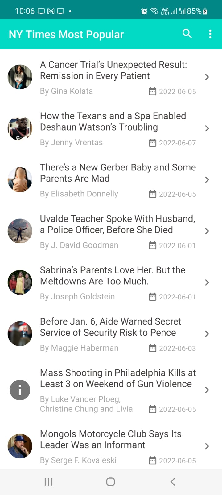
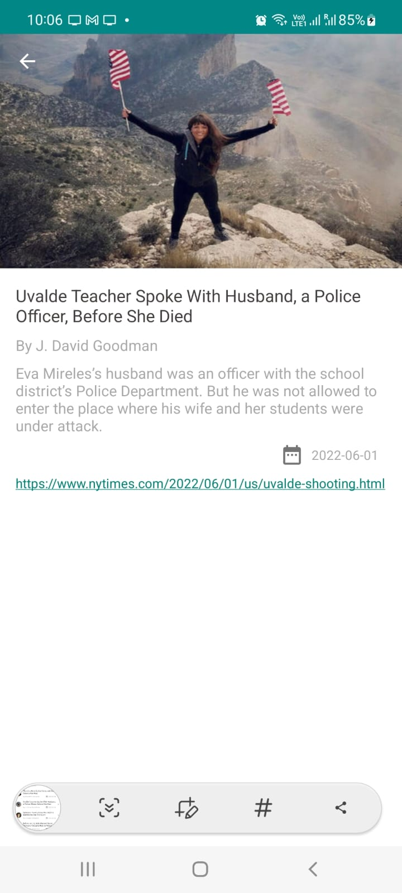

# NyTimesMostViewedArticle 📱
Android App using clean architecture , coroutines , Dagger2 

- Object oriented programming approach 
- Clean Architecture
- Use of Dagger
- Use of Jetpack components
- Retrofit and GSON

  

## Built With ⚙️
- [Kotlin](https://kotlinlang.org/) - First class and official programming language for Android development.
- [Coroutines](https://kotlinlang.org/docs/reference/coroutines-overview.html) - For asynchronous operation
- [LiveData](https://developer.android.com/topic/libraries/architecture/livedata) - Data objects that notify views when the remote data is available.
- [ViewModel](https://developer.android.com/topic/libraries/architecture/viewmodel) - Stores UI-related data that isn't destroyed on UI changes. 
- [Jetpack Navigation](https://developer.android.com/guide/navigation) - Navigation refers to the interactions that allow users to navigate across, into, and back out from the different pieces of content within your app
- [Material Components for Android](https://github.com/material-components/material-components-android) - Modular and customizable Material Design UI components for Android.
- [Android Architecture Components](https://developer.android.com/topic/libraries/architecture) - Collection of libraries that help you design robust, testable, and maintainable apps.

